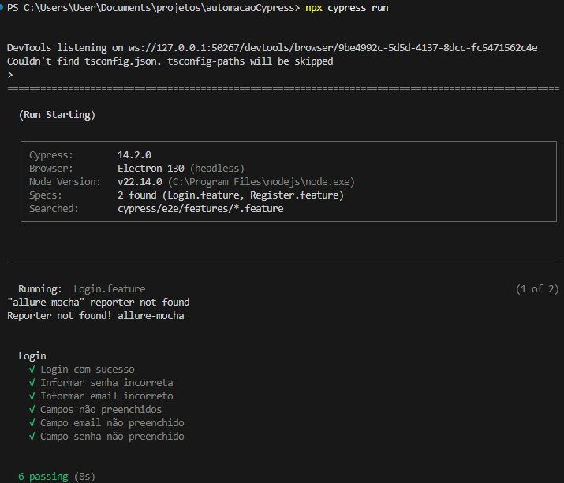
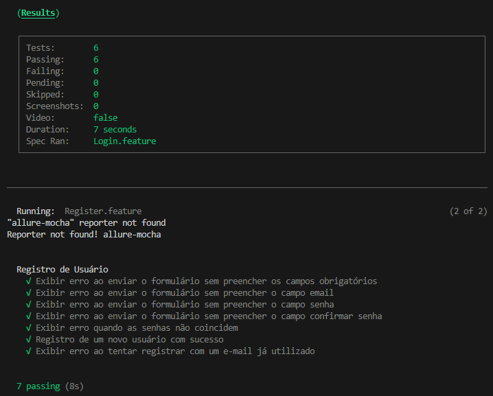
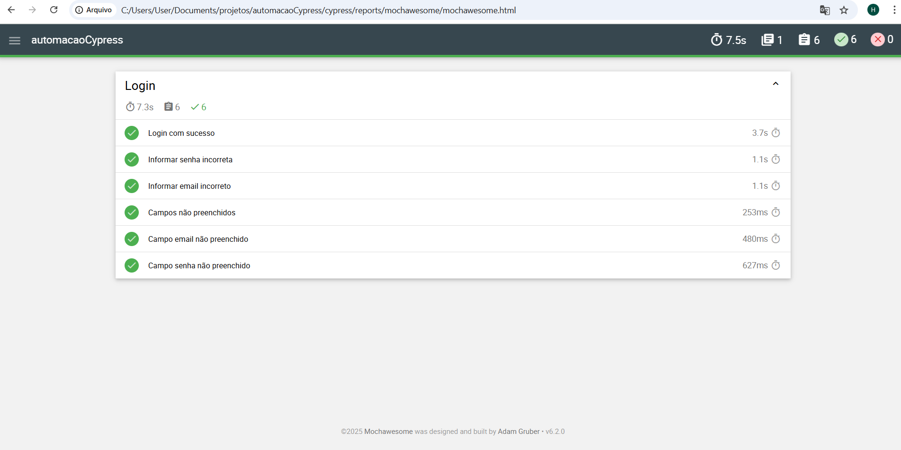

# Automação Web com Cypress, Cucumber e Relatórios com Mocha
Esses testes seguem o formato Gherkin, usado em ferramentas como Cucumber e Cypress para descrever testes automatizados de forma legível. Eles validam funcionalidades essenciais de Login e Registro de Usuário em um sistema.


## 📌 Feature: Login
Essa feature cobre os cenários de login, validando tanto o fluxo bem-sucedido quanto os casos de erro.

 - ✅ Cenário: Login com sucesso
Garante que um usuário com credenciais válidas pode acessar o sistema.
Testa se o login redireciona corretamente para a Dashboard.
 - ❌ Cenário: Informar senha incorreta
Simula um usuário que tenta logar com uma senha errada.
O sistema deve impedir o login e permanecer na tela.
 - ❌ Cenário: Informar email incorreto
Testa se um email inválido impede o login.
O usuário deve continuar na tela de login.
 - ⚠️ Cenário: Campos não preenchidos
Testa se o sistema exibe um aviso quando o usuário tenta logar sem preencher nada.
 - ⚠️ Cenário: Campo email não preenchido
O sistema deve exibir um alerta caso o usuário tente logar sem email.
 - ⚠️ Cenário: Campo senha não preenchido
Similar ao anterior, mas verificando se a senha obrigatória é exigida.

## 📌 Feature: Registro de Usuário
Essa feature cobre o fluxo de cadastro de um novo usuário, validando obrigatoriedade de campos, validação de senha e duplicidade de e-mail.

 - ⚠️ Cenário: Exibir erro ao enviar o formulário sem preencher os campos obrigatórios
O sistema deve alertar o usuário ao tentar cadastrar sem preencher nada.
 - ⚠️ Cenário: Exibir erro ao enviar o formulário sem preencher o campo email
O sistema deve impedir o registro e exibir um alerta se o campo email estiver vazio.
 - ⚠️ Cenário: Exibir erro ao enviar o formulário sem preencher o campo senha
O sistema deve impedir o registro sem senha.
 - ⚠️ Cenário: Exibir erro ao enviar o formulário sem preencher o campo confirmar senha
O sistema deve impedir o registro sem confirmação de senha.
 - ❌ Cenário: Exibir erro quando as senhas não coincidem
Garante que o sistema não permite registro quando a senha e a confirmação são diferentes.
 - ✅ Cenário: Registro de um novo usuário com sucesso
Simula um usuário preenchendo o formulário corretamente e validando o redirecionamento para a página de login.
 - ❌ Cenário: Exibir erro ao tentar registrar com um e-mail já utilizado
O sistema deve verificar se um email já está cadastrado e impedir o registro duplicado.


🎯 Objetivo dos Testes
Garantir a segurança e a usabilidade do login e registro.
Evitar falhas como login com credenciais erradas ou registros incompletos.
Testar mensagens de erro e fluxo correto do usuário.


## 🔧 Tecnologias Utilizadas

- Cypress
- Cucumber (BDD)
- Page Object Model (POM)
- SOLID
- **Relatórios:**
    - Mochawesome
- **CI/CD:**
    - Jenkins
    - GitHub Actions
    - Azure DevOps

## ⚙️ Instalação e Configuração

Clone o projeto
```bash
git clone https://github.com/hebroms/automacao-web-cypress.git
```
```bash
cd automacao-web-cypress
```
Instale as dependências
```bash
npm install
```

## 🏗️ Estrutura do Projeto

```bash
AUTOMACAOCYPRESS/
│── .github/
│   ├── workflows/
│   │   ├── cypress-tests.yml  # Pipeline de CI/CD para execução dos testes no GitActions
│── cypress/
│   ├── e2e/
│   │   ├── actions/           # Arquivos com ações de interação (Login, Registro, etc.)
│   │   ├── elements/          # Mapeamento de elementos da interface
│   │   ├── features/          # Arquivos .feature para os testes BDD
│   │   ├── pages/             # Classes Page Object Model (POM)
│   │   ├── step_definitions/  # Implementação dos Steps do Cucumber
│   ├── support/               # Suporte e comandos customizados
│   │   ├── generators/        # Geradores de dados aleatórios
│   │   ├── model/             # Modelos de dados
│   │   ├── commands.js        # Comandos customizados do Cypress
│   │   ├── e2e.js             # Configuração dos testes
│   │   ├── routes.js          # Configuração das rotas
│   │   ├── text.js            # Mensagens e textos utilizados
│── node_modules/              # Dependências do projeto
│── cypress.config.js          # Arquivo de configuração do Cypress
│── Jenkinsfile                # Pipeline de CI/CD para execução dos testes no Jenkins
│── azure-pipelines.yml        # Pipeline de CI/CD para execução dos testes no Azure
│── package.json               # Dependências do Node.js
│── package-lock.json          # Lock das versões do Node.js
```
## 🚀 Executando os Testes

Executar em modo headed (UI do Cypress):
```bash
  npx cypress open
```
## ✅ Geração de Relatórios

Executar os testes para gerar resultados
```sh
npx cypress run
```
[Download do Vídeo Testes de Login](Login.feature.png)

[Download do Vídeo Testes de Registro](Register.feature.png)




Relatórios Mochawesome

    Resultados em:

        /reports/mocha/*.html



## 🔄 CI/CD
### Jenkins

- Jenkinsfile configurado para:
    - Checkout
    - Instalação de dependências
    - Execução dos testes
    - Geração e publicação dos relatórios

Exemplo:
```groovy
pipeline {
  agent any
  stages {
    stage('Checkout') { ... }
    stage('Test') { sh 'npm run test' }
    stage('Allure Report') { ... }
  }
}
```
GitHub Actions / Azure DevOps

    GitHub Actions: .github/workflows/tests.yml
    Azure Pipelines: azure-pipelines.yml

## 👨‍💻 Autor

👨‍💻 Hebrom Chaves de Souza

🔗 [LinkedIn](https://www.linkedin.com/in/hebrom-c-s/)

📧 hebromsouza@gmail.com